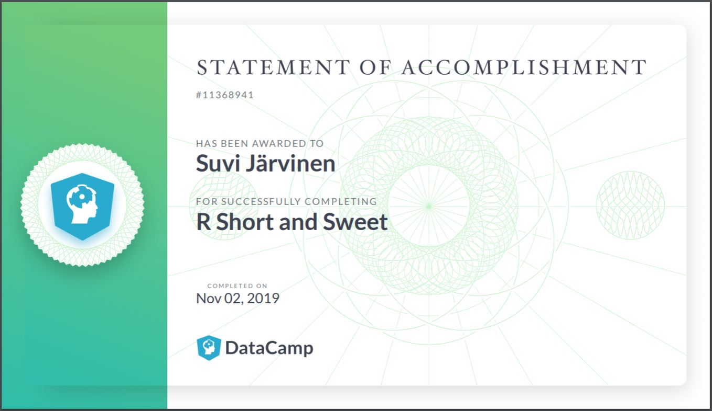

# About the project

*Write a short description about the course and add a link to your GitHub repository here. This is an R Markdown (.Rmd) file so you can use R Markdown syntax.*

# My current thoughts

Still feeling excited about this course! It was fun to see in the DataCamp exercises how R differs from Python as a language. I think the timetable for this course could have been more clear - it took some extra effort to figure out the actual deadlines for the exercise submissions and peer-reviews. Anyhow, I expect to learn in this course how to use R for data analysis, which should prove *very* useful in the future.

# Link

Here's the link to my GitHub repository: https://github.com/saejarvi/IODS-project

# Test picture

